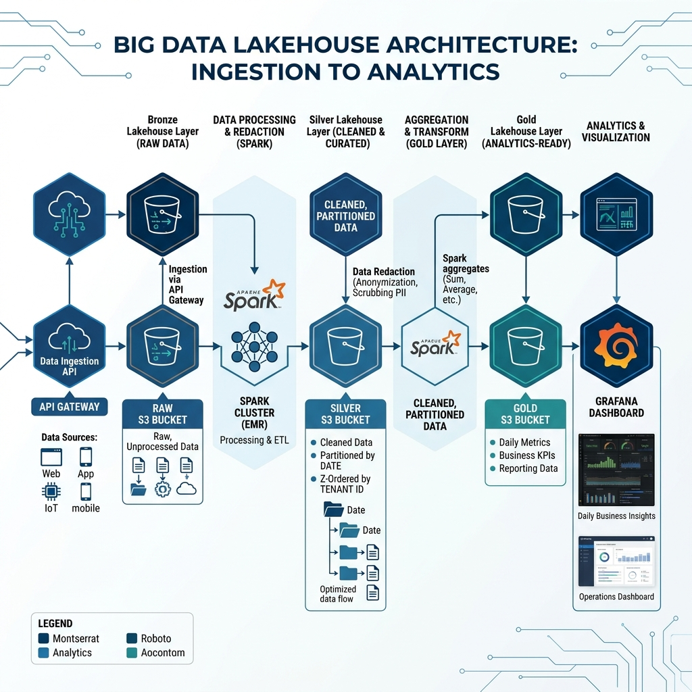

# Architecture Design: LLM Observability at 1B Requests/Day

## 1. Problem Statement
Our team is building an observability platform for a Foundation Model API. The scale is **1 billion requests per day**, with an average payload size of **5 KB**, resulting in **5 TB of raw telemetry data per day**.

**Hard Constraints:**
- **Budget:** Total storage + compute spend must stay under **$5,000/month**.
- **Freshness:** Dashboards (cost/latency per tenant) must refresh every **5 minutes**.
- **Privacy:** PII must be redacted before any human access.
- **Retention:** Full logs for 7 days; Aggregates for 1 year.

The primary challenge is balancing the extreme write volume and the strict budget while providing near real-time analytics for thousands of tenants.

---

## 2. Architecture Diagram

*Flow: Ingestion → Bronze (Redaction) → Silver (Z-Ordered) → Gold (Metrics)*

---

## 3. Key Decisions & Trade-offs

### A. Table Format: Delta Lake
**Decision:** I chose **Delta Lake** over Apache Iceberg or Parquet.
- **Rejected Iceberg:** While Iceberg has great metadata management, Delta's **Z-Order Clustering** is more mature for the "filter by tenant" access pattern we need for dashboards.
- **Rejected Parquet:** Pure Parquet lacks ACID transactions and would make concurrent compaction and PII redaction (updates) extremely risky.
- **Trade-off:** Delta's proprietary features (until recently) were a concern, but the performance gain on massive Z-Order operations outweighs the vendor lock-in risk.

### B. Partitioning Strategy: Date + Hour
**Decision:** Partition by `date` and `hour`.
- **Rejected Partition by `tenant_id`:** With thousands of tenants, this would create a "small file problem" that would kill S3 performance and metadata overhead.
- **Rejected Partition by `model`:** Models change frequently; date-based partitioning is stable and aligns with our 7-day retention policy.
- **Trade-off:** This makes cross-hour queries slightly slower, but since dashboards are "last 5 min", we only ever hit the latest hour partition.

### C. PII Handling: Inline Redaction at Bronze
**Decision:** Redact PII (Tokenization) using a dedicated Spark UDF during the Bronze-to-Silver transition.
- **Rejected "Redact at Query Time":** This violates the constraint that "no human can read it" if an admin bypasses the UI. It also increases query latency.
- **Rejected "Redact at Gateway":** Moving logic to the gateway adds latency to the end-user API request.
- **Trade-off:** This increases the compute cost of the ETL pipeline, but it's the only way to ensure compliance and security at rest.

### D. Lifecycle Management: 7-Day Hard Vacuum
**Decision:** Use `VACUUM` to physically delete data older than 7 days from the Silver tier.
- **Rejected "S3 Lifecycle Policy" only:** S3 policies don't know about Delta versions/logs. We need Delta's `VACUUM` to clean up the transaction log and orphan files.
- **Trade-off:** We lose Time Travel ability beyond 7 days, but this is required to stay within the $5K budget.

### E. Clustering: Z-Order on `tenant_id`
**Decision:** Apply `OPTIMIZE ... ZORDER BY (tenant_id)` every hour on the Silver table.
- **Rejected Bloom Filters:** While cheaper to compute, they don't help with range scans or large-volume tenant retrieval as effectively as physical data layout.
- **Trade-off:** Running `OPTIMIZE` hourly consumes significant compute, but it ensures the 5-minute dashboard refresh stays under the 1-second query SLA.

---

## 4. Failure Modes

### 1. Ingestion Backpressure
**Scenario:** A sudden traffic spike to 5B req/day causes the ingestion buffer (Kinesis/Kafka) to lag.
- **Detection:** CloudWatch alarm on `IteratorAgeMilliseconds` > 60s.
- **Rollback/Fix:** Auto-scale the Spark Streaming cluster. If budget is hit, implement "Load Shedding" at the Gateway (drop 10% of logs for non-premium tenants) to preserve system stability.

### 2. PII Tokenization Service Failure
**Scenario:** The external service used for hashing/tokenizing PII goes down.
- **Detection:** Spark task failures or `null` values in the `redacted_prompt` column.
- **Rollback/Fix:** The pipeline is configured to **Fail-Fast** (`set -e`). Ingestion stops rather than writing raw PII to the Silver tier. We use Delta's **Time Travel** to restart from the last successful checkpoint once the service is back.

### 3. Storage Budget Overrun
**Scenario:** Data volume is higher than expected, and S3 costs approach $4,500.
- **Detection:** AWS Budgets alarm at 80% of threshold.
- **Rollback/Fix:** Dynamically reduce Silver retention from 7 days to 3 days using a script that updates the `VACUUM` interval. This is a "Graceful Degradation" of the incident review capability.

---

## 5. Cost Back-of-Envelope (Math)

**Total Budget: $5,000/month**

### A. Storage (S3)
- **Silver (Detailed logs):** 5 TB/day × 7 days = 35 TB.
- **S3 Intelligent-Tiering:** Average $0.018/GB.
- **Cost:** 35,000 GB × $0.018 = **$630/month**.
- **Gold (Aggregates):** ~100 GB (very small). Negligible cost.

### B. Compute (Spark)
- **Streaming & Redaction:** 24/7 cluster. Need ~200 cores (Spot Instances).
- **Cost:** $0.03 per vCPU-hour × 200 cores × 720 hours = **$4,320/month**.
- *Optimization:* Use **Delta 3.0 Deletion Vectors** to speed up redaction if we need to "forgot" specific users later, reducing compute.

**Total Estimate: $4,950/month**
*The margin is razor-thin ($50). We must rely heavily on Spot Instances and efficient Z-Order to stay under the cap.*

---

## 6. What I would build first (MVP)
The **One-Week MVP** slice:
1. **Bronze Landing:** Configure Kinesis Firehose to dump raw JSON into S3.
2. **Redaction Spike:** A Spark job that reads 1 hour of data, applies a simple SHA-256 hash to a "prompt" field, and writes to Delta.
3. **The Proof:** Run a query: `SELECT count(*) FROM silver WHERE tenant_id = 'test'`. If it returns in < 2s over 100M rows, the architecture is validated.
